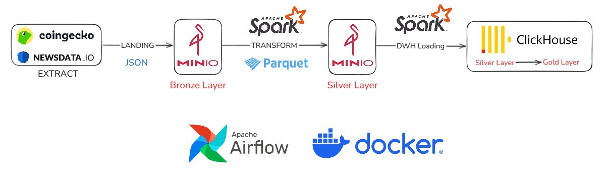

# 🚀 CryptoNews-Pipeline

An end-to-end **ELT pipeline** designed to correlate cryptocurrency market data with global news sentiment. 

## 🎯 Project Overview
This pipliene collects crypto prices from CoinGecko and new articles from NewsAPI, processes them trhough transformation layers, and loads the results into an analytical warehouse. The project follows a Medallion Architecture (Bronze, Silver, Gold). The core idea is to correlate market price movements with new sentiment. 

## 🏗 Tech Stack
🛠️ Tech Stack
**Orchestration:** Apache Airflow - Manages workflow scheduling and monitoring.
**Processing:** Apache Spark - Handles large-scale data transformation.
**Data Lake:** MinIO - High-performance object storage.
**Data Warehouse:** ClickHouse - Real-time analytics database.
**Infrastructure:** Docker - Containerization for consistent development and deployment environments.

## 📊 Data Sources
**CoinGecko API** — free tier, no auth required
Endpoint: /coins/markets
Data: price, market cap, volume, 24h change per coin

**NewsAPI** — free tier, API key required
Endpoint: /everything
Data: article title, description, source, published date

